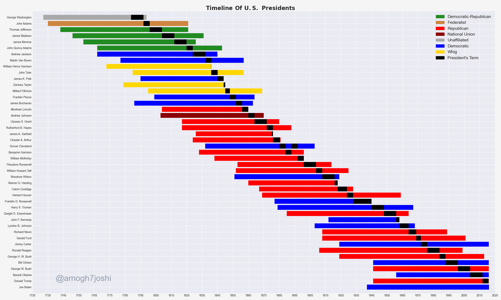
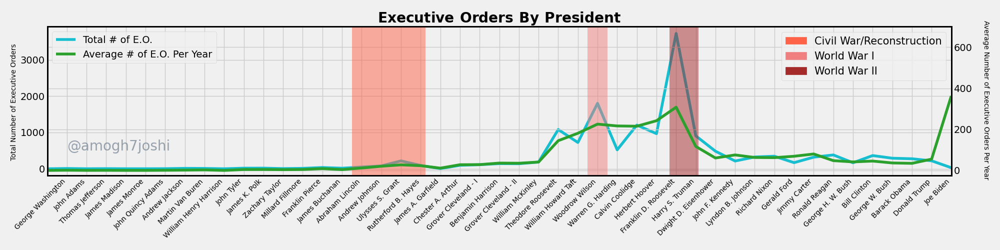

# History Visualized

Visualizations of historical data in the fields of history, anthropology, theology, and geography.

## Research

Each directory within this repository is home to a specific research submodule, within which
data is acquired, parsed, and developed into a diagram.

Currently, research is (and has been) conducted in the following modules:

### [United States Presidents](https://github.com/amogh7joshi/history-visualized/tree/master/presidents)

Research and visualizations of different aspects of the presidential terms and to an extent, the actual lives
of past Presidents of the United States.

### [Nations of the World](https://github.com/amogh7joshi/history-visualized/tree/master/nations)

Research and visualizations of historical and geographic data surrounding the current nations of the world.

### [World Macroeconomics](https://github.com/amogh7joshi/history-visualized/tree/master/money)

Research and visualizations of historical macroeconomic data, such as nation GDP and GWP, as well as share of 
the world market by each country over time. 

## Sources

Data is either scraped and parsed directly from Wikipedia (see [query](https://github.com/amogh7joshi/history-visualized/README.md##Research)
for in-depth information on how the information is gathered), or through verified external sources (e.g., the Maddison Project for historical 
world and nation GDP data). The visualizations are generated in the individual research submodules using matplotlib and numpy from this data, 
and may not be used without permission.

